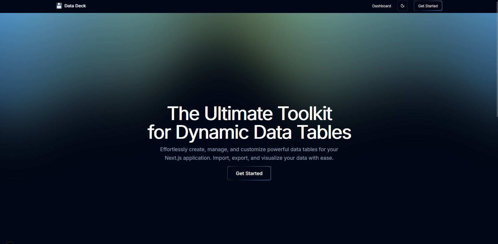

# Data Deck
<div align="center">
   
   <h3 align="center">The Ultimate Toolkit for Dynamic Data Tables</h3>
   <p align="center">
      A powerful, customizable Next.js application for creating beautiful interactive data tables
   </p>
</div>

## 🌟 Features

- **Interactive Data Tables**: Powerful tables with sorting, searching, filtering, and pagination capabilities
- **Dynamic Column Management**: Easily show, hide, or reorder columns with preferences saved to local storage
- **CSV Import/Export**: Seamlessly import data from CSV files and export the current table view
- **Responsive Design**: Beautiful UI that works perfectly on desktop and mobile devices
- **Theme Toggle**: Switch between light and dark modes for optimal viewing comfort
- **Modern UI Components**: Built with shadcn/ui and styled with Tailwind CSS
- **TypeScript Support**: Fully typed components for better developer experience

## 📋 Prerequisites

- Node.js 18.0.0 or later
- npm or yarn package manager

## 🚀 Installation

1. **Clone the repository**

   ```bash
   git clone https://github.com/yourusername/datadeck.git
   cd datadeck
   ```

2. **Install dependencies**

   ```bash
   npm install
   # or
   yarn install
   ```

3. **Run the development server**

   ```bash
   npm run dev
   # or
   yarn dev
   ```

4. **Open your browser**

   Navigate to [http://localhost:3000](http://localhost:3000) to see the application running.

## 🏗️ Build for Production

```bash
npm run build
# or
yarn build

# Then start the production server
npm start
# or
yarn start
```

## 🧰 Tech Stack

- **Framework**: [Next.js](https://nextjs.org/)
- **UI Components**: [shadcn/ui](https://ui.shadcn.com/)
- **Styling**: [Tailwind CSS](https://tailwindcss.com/)
- **Icons**: [Lucide Icons](https://lucide.dev/)
- **Animations**: Custom Aurora component and Shine Border effects

## 📂 Project Structure

```
datadeck/
├── src/
│   ├── app/           # Next.js app router components
│   ├── components/    # Reusable UI components
│   ├── data/          # Mock data and data utilities
│   ├── ai/            # AI integration components
│   ├── hooks/         # Custom React hooks
│   └── lib/           # Utility functions
├── public/            # Static assets
└── docs/              # Documentation files
```

## 🧩 Key Components

- **Dashboard**: Main data interaction view
- **Data Table**: Core table component with extensive functionality
- **Aurora**: Beautiful gradient background effect
- **ShineBorder**: Interactive border animation for UI elements
- **Theme Toggle**: Light and dark mode switcher

## 🔧 Configuration

The application can be configured through environment variables. Create a `.env.local` file in the root directory:

```
# Example configuration
NEXT_PUBLIC_API_URL=https://your-api-endpoint.com
```

## 🤝 Contributing

Contributions are welcome! Please feel free to submit a Pull Request.

1. Fork the repository
2. Create your feature branch (`git checkout -b feature/amazing-feature`)
3. Commit your changes (`git commit -m 'Add some amazing feature'`)
4. Push to the branch (`git push origin feature/amazing-feature`)
5. Open a Pull Request

## 📄 License

Distributed under the MIT License. See `LICENSE` for more information.

## 📬 Contact

Daksh Rana - [dakshrana1410@gmail.com](mailto:dakshrana1410@gmail.com)

Project Link: [https://github.com/yourusername/datadeck](https://github.com/yourusername/datadeck)
